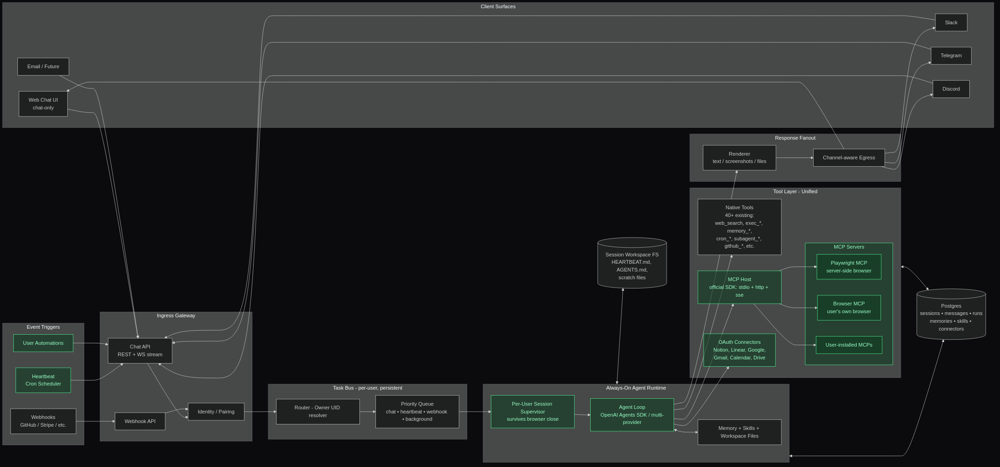
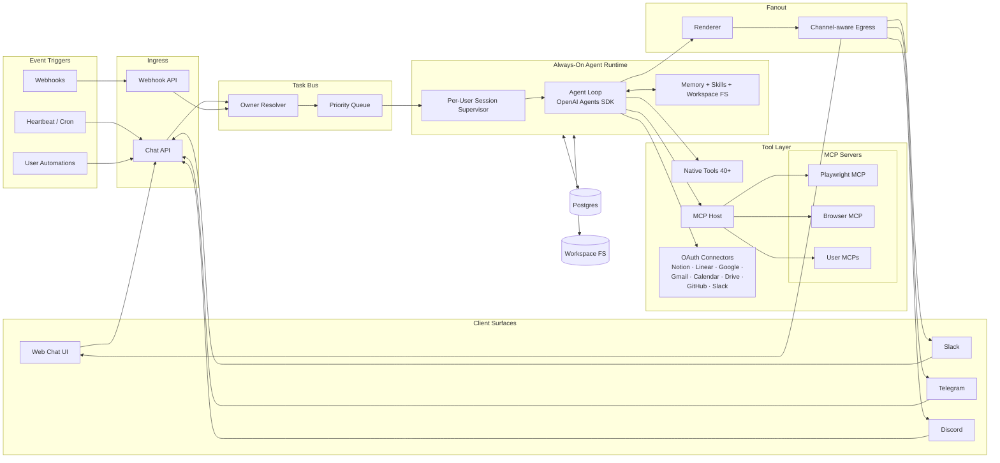

# Aegis — Always-on AI Coworker

**Aegis** by Chronos is a chat-first, always-on AI coworker.
One persistent agent per user, shared across every channel you talk to it on — web, Slack, Telegram, Discord, webhooks, and scheduled heartbeats.

> Production: **[mohex.org](https://mohex.org)** · Docs: in-app under **Docs**

---

## What it does

- **One agent, many surfaces.** Start a task in the web chat, continue it from Slack, have it ping you on Telegram overnight when it finishes. Same session, same memory, same workspace files.
- **Runs even when you close the tab.** The runtime lives server-side. Heartbeats, scheduled automations, and webhook-triggered tasks all fire with no open client.
- **Tools everywhere.** 40+ built-in tools (web search, code execution, memory, workspace files, cron, subagents, GitHub) plus real OAuth connectors (Notion, Linear, Google — Gmail/Calendar/Drive, Slack, GitHub) and live MCP servers (Playwright, Browser MCP, anything you add).
- **Compaction you can trust.** When the context window fills, the agent summarizes, checkpoints, and keeps going. The UI meter shows the *real* loaded footprint — system prompt, active skills, workspace files, pinned memories, and chat history all included.
- **Multi-model.** OpenAI, Anthropic, Google, Mistral, Groq, or any LiteLLM-compatible provider. BYOK with encrypted-at-rest key storage.

## Architecture





**Key properties:**

- One `SessionSupervisor` per user. All surfaces are subscribers + producers on the same inbox.
- Browser is a **tool**, not the runtime. Playwright MCP and Browser MCP are selected per task.
- Screenshots render inline in the originating chat surface — no standing browser panel.
- Compaction checkpoints preserved: session survives multi-day work within context limits.

## Tech Stack

- **Frontend:** React + TypeScript + Vite + Tailwind v4
- **Backend:** FastAPI + async Postgres (SQLAlchemy/asyncpg)
- **Agent loop:** OpenAI Agents SDK (`openai-agents`) + LiteLLM for multi-provider
- **MCP:** official `mcp` Python SDK — stdio, http, sse
- **Deploy:** Railway (backend + Postgres) + Netlify (frontend)

## Runtime signals

| Signal | Endpoint | Meaning |
|---|---|---|
| Startup status | `GET /health` | `ok` / `degraded` |
| Heartbeat status | `GET /api/heartbeat/status` | `enabled` / `disabled`; only claim always-on when enabled |
| Session context meter | `GET /api/runtime/context-meter/{session_id}` | Token breakdown by bucket: system prompt, skills, workspace files, memories, chat |
| Integration ownership | `GET /api/integrations/status` | Configured / missing |

---

## Quick Start

### Docker Compose (local dev)

```bash
cp .env.example .env          # fill in at least one LLM key
docker compose up -d           # starts postgres + app
open http://localhost:8000
```

### Local development

```bash
# Backend
pip install -r requirements.txt
cp .env.example .env
uvicorn main:app --reload

# Frontend (separate terminal)
cd frontend && npm install && npm run dev
```

The backend spawns MCP servers on demand. Playwright MCP is bundled; other MCP servers are installed per-user from the Connections settings page.

---

## Deploy

### Backend → Railway

```bash
npm i -g @railway/cli
railway login
railway link
railway up
```

Add a PostgreSQL plugin. Set these environment variables:

| Variable | Purpose |
|---|---|
| `SESSION_SECRET` | Signs session cookies (32+ random chars) |
| `ENCRYPTION_SECRET` | Encrypts BYOK provider keys at rest |
| `ADMIN_EMAILS` | Comma-separated emails auto-promoted to admin |
| `PUBLIC_BASE_URL` | Public backend origin (for OAuth callbacks) |
| `FRONTEND_URL` | Frontend origin (for redirects + CORS) |
| `CORS_ORIGINS` | Additional allowed origins |
| `COOKIE_SECURE` | `true` in production |
| `COOKIE_SAMESITE` | `lax` if same-site, `none` if cross-site |
| `OPENAI_API_KEY` | Default provider key (any of OPENAI/ANTHROPIC/GEMINI/etc. works) |

OAuth callback URLs derive from `PUBLIC_BASE_URL`:
- `https://<backend>/api/auth/google/callback`
- `https://<backend>/api/auth/github/callback`
- `https://<backend>/api/auth/sso/callback`

Recommended topology:
- Frontend: `https://mohex.org`
- Backend: `https://api.mohex.org`

### Frontend → Netlify

Dashboard flow:
1. app.netlify.com → Add new site → Import GitHub repo
2. Settings auto-detected from `netlify.toml`
3. Environment variables:
   - `VITE_API_URL` = `https://api.mohex.org`
   - `VITE_WS_URL` = `wss://api.mohex.org/ws/chat`
4. Deploy

CLI flow:
```bash
npm i -g netlify-cli
netlify init
netlify env:set VITE_API_URL https://api.mohex.org
netlify env:set VITE_WS_URL  wss://api.mohex.org/ws/chat
netlify deploy --prod
```

### Seed first superadmin

```bash
python scripts/seed_super_admin.py \
  --email admin@mohex.org \
  --password "ChangeThis123!" \
  --name "Aegis Admin"
```

---

## Environment Variables

| Variable | Required | Description |
|---|---|---|
| `DATABASE_URL` | Yes (prod) | Postgres connection string |
| `SESSION_SECRET` | Yes | Session cookie signing |
| `ENCRYPTION_SECRET` | Yes | BYOK key encryption |
| `PUBLIC_BASE_URL` | Yes (prod) | Public backend origin |
| `FRONTEND_URL` | Yes (split deploy) | Frontend origin |
| `COOKIE_SECURE` | Yes (prod) | `true` in production |
| `COOKIE_SAMESITE` | Depends | `lax` or `none` |
| `ADMIN_EMAILS` | No | Auto-admin list |
| `CORS_ORIGINS` | No | Allowed origins |
| `HEARTBEAT_SESSION_ENABLED` | No | Default `true`; toggles scheduled heartbeat |
| `HEARTBEAT_SESSION_INTERVAL_SECONDS` | No | Default `180` |
| `COMPACT_THRESHOLD_PCT` | No | Default `90`; context-window compaction trigger |
| `OPENAI_API_KEY` / `ANTHROPIC_API_KEY` / `GEMINI_API_KEY` / `MISTRAL_API_KEY` / `GROQ_API_KEY` | No | Default provider keys |
| `VITE_API_URL` / `VITE_WS_URL` | Frontend | Backend URLs when hosted separately |

See `.env.example` for the full list.

## Contributing

This is a proprietary codebase. For internal contributors, see `AGENTS.md` and `ONBOARDING.md` for session-by-session implementation notes, and `PLAN.md` for the current rewrite's phased migration plan.

## License

Proprietary — © 2024–2026 Chronos AI
